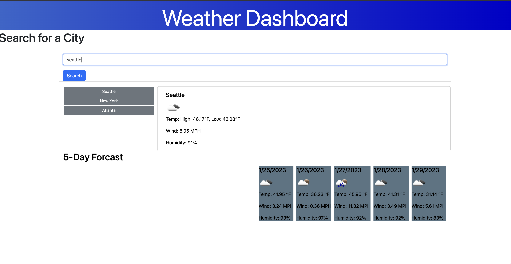

# Weather Dashboard

## Description

The weather dashboard is a simple site to get current and 5 day weather for a given city, enter a city name

## Usage
https://kyleoetjens.github.io/weatherApp/
Use the dashboard to find weather forcasts

    

## Credits

Meg Meyers (Bootcamp tutor)
MDN
Stack Overflow
Bootcamp Learning Assistants 

## Features

Getting current weather based on city input
Getting 5 day forcast for desired city
Saving searches
